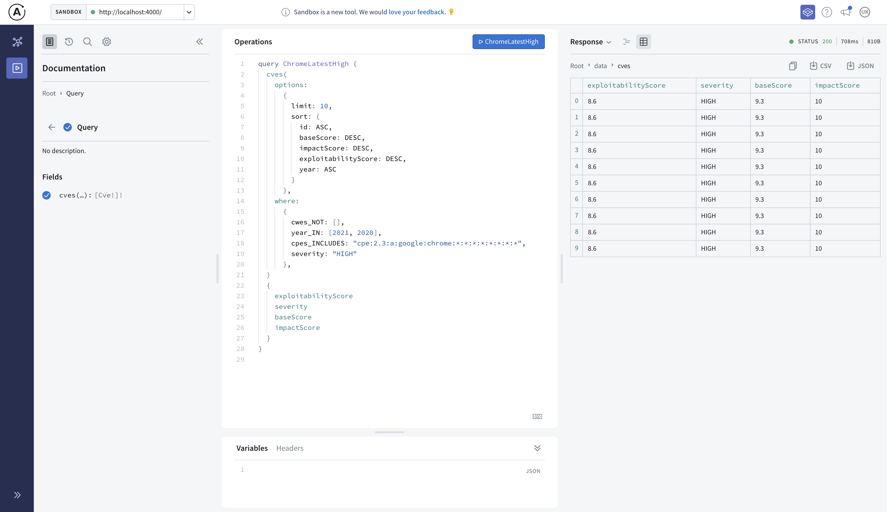

[](https://github.com/inspektre/vulnhub/actions/workflows/codeql-analysis.yml) 
[](https://github.com/inspektre/vulnhub/actions/workflows/npm-publish.yaml)
[](https://github.com/inspektre/vulnhub/actions/workflows/nvd.yml)

 ```
 __      __      _         _    _         _
 \ \    / /     | |       | |  | |       | |
  \ \  / /_   _ | | _ __  | |__| | _   _ | |__
   \ \/ /| | | || || '_ \ |  __  || | | || '_ \ 
    \  / | |_| || || | | || |  | || |_| || |_) |
     \/   \__,_||_||_| |_||_|  |_| \__,_||_.__/ 

```

 ```(:Attacks)->[:THINK]-(:Graphs)-[:SHOULD_THINK]<-(:Defenders)```

## To-Do

- Add CPEs to the seeding process.
- @neo4j/graphql@2.0.0-alpha offers relationships in the beta library where connections to nodes can be made easily. This feature is soon to be realized with CPEs and CVEs


NVD CVEs in under 60 seconds.

## What is CVE?

Please visit  MITRE at https://cve.mitre.org/ to read more about what CVEs are. Below is a quick gist in two sentences.

- Common vulnerabilities & Exposures (CVEs) is a list of publicly disclosed computer/software/hardware security flaws, including security advisories from vendors. 
- The format is CVE-YYYY-XXXXX and can be interpereted as a sequence in a given year starting from 2002.


## Installation

To install `vulnhub` as CLI, Please ensure to use either `npm` or `yarn` package managers.
- `yarn`: `yarn global add @inspektre/vulnhub`.
- `npm`: `npm i -g @inspektre/vulnhub`

## Getting Started

To get started, visit the wiki section.

## Apollo Studio

To start the GraphQl server, type: 
- In Production mode: `vulnhub serve`
- In Development mode: `./bin/run serve`



## Prerequsities
1. Nodejs v14+
2. Yarn or npm to install JavaScript dependencies.
3. Neo4J Database!

## Development mode
- To install dependencies, type `yarn run`.
- To run GraphQL Server, type `yarn start`.
- To seed database with CVEs, type `yarn seed`.

## Environment variables
The name of the database can be anything string. However, nvd is the most appropriate.
```
NEO4J_URI=bolt+s://<IP/FQDN>:7687
NEO4J_USER=<username>
NEO4J_PASSWORD=<pwd>
NEO4J_DATABASE=nvd
BASE_DIR=/home/vulnhub/feeds/cve
```

# Why Neo4J

obs=(:Graphs)-[:ARE]-(:Everywhere) RETRUN obs;

Graphs make it more intuitve in searching for patterns, establishing relationships as first-class citizens instead of Foreign Keys Primary Keys. Creating CVE Knowledge Graphs is the goals of this project for collective public benefit.


## Setting up Neo4J Database.
There are many-a-ways for getting started with your neo4j database. Below are recommendations, please choose an option that best suits your needs.

1. Ensure that you have at-least 4 GB of storage with Neo4j Aura (Neo4J DBaaS). Theisfastest way is to get started (https://console.neo4j.io/#databases). As the CVE database is way beyond the free-tier limits. However Aura is reasonably priced.
2. Spin-up a Neo4j community edition server on Azure, AWS or GCP compute.
3. Spin-up a compute on alternate cloud-server providers (upcloud | DO | vultr | linode and etc.).

With options 2 & 3, Please ensure to do the following: (Based on upcloud tests)

- Spin up compute with at-least 16 GB Memory and 4 vCPUs.
- Perform seeding with `yarn seed` (Takes about 45 seconds)
- Spin down the compute and downgrade to at half the capacity for acceptable daily-use.

## Database memory & configuration

Neo4J Memory configurations below are for reference. Overall, having Neo4j (Preferrably any linux distro) with at least 32 GB Memory with 6 vCPUs has significant seeding performance. Additionally, neo4j can be deployed to a kubernetes for theoritical unlimited scalability for your CVE Graphs.
```
dbms.memory.heap.initial_size=1g
dbms.memory.heap.max_size=6g
dbms.memory.pagecache.size=8g
dbms.memory.transaction.global_max_size=4g
dbms.memory.transaction.max_size=2g
```

During seeding, a significant amount of memory is used to quickly create relationships between nodes. Once the seeding is complete, relationships will be continually evaluated for delta and hence our rationale in recommendations to use these 

## Need help?
If you need help with this project, please do create an issue. We will help you on a best-effort basis.


## GraphQL
- The oroginal GraphQL API (neo4j-graphql) has been temprarily removed.
- This project will now use the recently released `@neo4j/graphql` library.

## History

Vulnhub started originally in Nov 2016 as part of a programming-assignment for a job-interview. The interview was successful but the code-base was left abandoned. The whole code-base was over-engineered in Python.There were minor updates between 2017 through 2019. The original database of choise was `postgresql` & `python` with SQLAlchemy as the ORM. NodeJS, GraphQL and Neo4j (Based off grand-stack) were introduced in 2020. 


**Special** note of thanks.
[Adam Heczko](https://github.com/miradam) helped restore ownership in 2019. The repository is now back to the right owner and is being maintained under the Aegis of inspektre.
